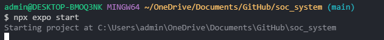
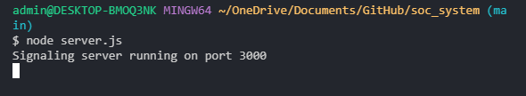
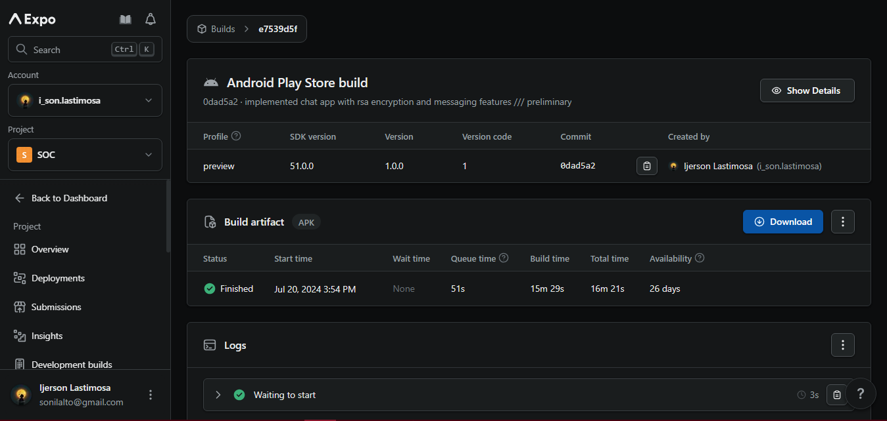
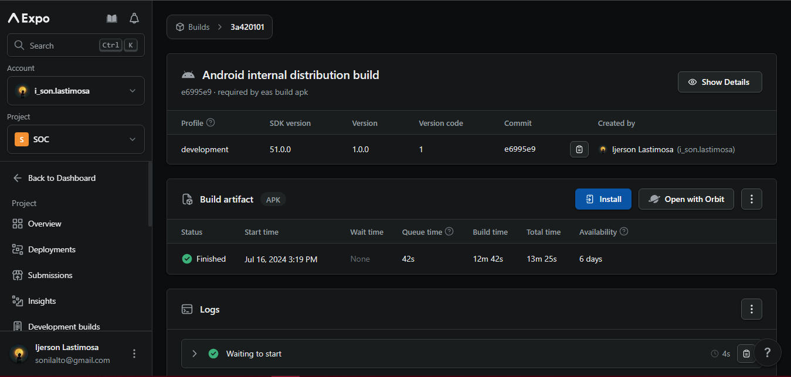

# Safe-on-Chat 
<!--  -->

## FEATURES

### Authentication
* Login (Authentication)
* Registration (Authentication)

### Security
* RSA/AES Encryption & Decryption (Security)
* Disable Screenshot & Screen Recording (Security)
* PIN (Security)
* Fingerprint (Security)

### Chat Features
* Chats List
* Calls List
* Group Chats List
* 1-on-1 Chat 
* Group Chats
* File Send (Images, Documents)
* Typing Indicator
* Video Call 
* Audio Call

### Services
* Expo Services
    * Development Build (Customized Expo Go)
    * Production Build (APK)
* Firebase Services 
    * Authentication (Login, Registration) 
    * Firestore (Database)
    * Storage (Documents/Images)


## PREREQUISITES BEFORE RUNNING 
> Install the latest version of __Node.js__ on the link below and follow the set up instructions.

[DOWNLOAD NODE.JS HERE](https://nodejs.org/en/download/prebuilt-binaries)

> Have an Expo Dev account for building APK's and Development Builds.

[SIGN UP FOR AN EXPO DEV ACCOUNT HERE](http://expo.dev/)

## USAGE
After downloading this github repository or obtaining the codes, run the command below in the terminal of the folder's root directory. This command installs all the dependencies for the mobile application.

```
npm install
```

then run the commands below at the same time in two different terminals,


- __FIRST TERMINAL__
```
npx expo start
```


- __SECOND TERMINAL__

```
node server.js
```


>In the file __screens/VideoCallScreen.js__, edit the line 24 to the _IP address_ of your device to enable _video/audio calling_.

### Process of Video/Audio Calling 
- The caller shoud press __Start Call__ and the __Green Button__ to start a call to the recipient.
- Other recipient should also press __Start Call__ after the caller shows up in the recipient's call.
- The caller should __press again the green button__ in order to start video calling.

## BUILD APKs AND DEVELOPMENT BUILDS USING EAS
Create an expo dev account [here](http://expo.dev/).

After creating an account, follow the instructions given in this [documentation](https://docs.expo.dev/build/setup/) for setting up eas.

__BUILD AN APK__
> To build an apk using eas, follow this [documentation](https://docs.expo.dev/build-reference/apk/).

_Screenshot of Successful APK Build using EAS._



__BUILD AN EXPO DEVELOPMENT BUILD__
> To build an expo development build using eas, follow this [documentation](https://docs.expo.dev/develop/development-builds/create-a-build/).

_Screenshot of Successful Expo Development Build using EAS._

